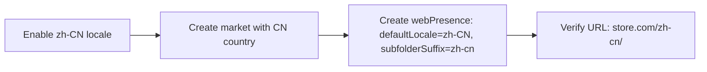
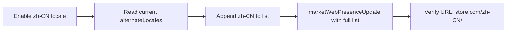
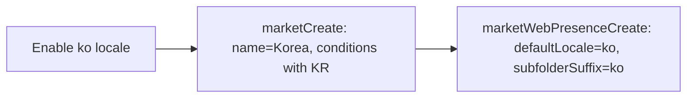

# Market & Language Setup Reference

This reference documents how to check a store's language and market configuration, and how to create or update markets with proper locale settings using Shopify Admin GraphQL API.

## Overview

When a user requests translation into a target language, the agent MUST first check:

1. Whether the language (locale) is enabled and published in the store
2. Whether the language is present in any market's web presence (as default or alternate)
3. Whether the language is the primary language of any market

After translation completes, the agent MUST present a summary of these configuration states and guide the user to properly configure markets if needed.

## API Reference

All queries and mutations use Shopify Admin GraphQL API version 2026-04.

### Query: shopLocales

**Scope:** `read_locales`

```graphql
query {
  shopLocales {
    locale     # BCP 47 code: "en", "de", "fr", "zh-CN", "ja"
    primary    # Boolean. Only one locale is the store authoring language.
    published  # Boolean. True = visible to customers on storefront.
  }
}
```

### Mutation: shopLocaleEnable

**Scope:** `write_locales`

Enable a new locale (adds it to the store). Published is always `false` after enable.

```graphql
mutation {
  shopLocaleEnable(locale: "zh-CN") {
    shopLocale { locale published }
    userErrors { field message }
  }
}
```

### Mutation: shopLocaleUpdate

**Scope:** `write_locales`

Update locale settings (publish/unpublish).

```graphql
mutation {
  shopLocaleUpdate(locale: "zh-CN", shopLocale: { published: true }) {
    shopLocale { locale published }
    userErrors { field message }
  }
}
```

### Query: markets

**Scope:** `read_markets`

```graphql
query {
  markets(first: 20) {
    nodes {
      id
      name
      enabled
      primary
      status       # ACTIVE or DRAFT
      webPresence {
        id
        rootUrls { locale url }
        defaultLocale { locale }
        alternateLocales { locale }
      }
    }
  }
}
```

**Field notes:**
- `webPresence: null` means the market has no dedicated URL structure
- `alternateLocales`: additional languages accessible via locale-prefixed URLs
- `defaultLocale`: the language shown without a locale prefix in this market
- `primary: true` = the merchant's home market

### Mutation: marketCreate

**Scope:** `write_markets`

Create a new market with country regions and optional web presence.

```graphql
mutation($input: MarketCreateInput!) {
  marketCreate(input: $input) {
    market { id name handle status conditions { regionsCondition { regions(first: 10) { edges { node { id name } } } } } webPresence { id rootUrls { locale url } defaultLocale { locale } alternateLocales { locale } } }
    userErrors { field message }
  }
}
```

Variables:
```json
{
  "input": {
    "name": "China",
    "handle": "cn",
    "status": "ACTIVE",
    "conditions": {
      "regionsCondition": {
        "regions": [
          { "countryCode": "CN" }
        ]
      }
    }
  }
}
```

**Country codes** use ISO 3166-1 alpha-2: `US`, `CA`, `GB`, `DE`, `FR`, `JP`, `CN`, `KR`, `BR`, `AU`, etc.

After creating a market, create its web presence separately (see below).

### Mutation: marketUpdate

**Scope:** `write_markets`

Update existing market properties.

```graphql
mutation {
  marketUpdate(id: "gid://shopify/Market/123", input: { name: "New Name", status: ACTIVE }) {
    market { id name status }
    userErrors { field message }
  }
}
```

### Mutation: marketWebPresenceCreate

**Scope:** `write_markets`

Create a web presence for a market after it has been created.

```graphql
mutation {
  marketWebPresenceCreate(marketId: "gid://shopify/Market/123", webPresence: {
    defaultLocale: "zh-CN"
    alternateLocales: ["en"]
    subfolderSuffix: "zh-cn"
  }) {
    market { id webPresence { id rootUrls { locale url } defaultLocale { locale } alternateLocales { locale } } }
    userErrors { field message }
  }
}
```

**Important notes about web presence creation:**
- **Web presence limit**: Each store has a maximum number of web presences. Typically this limit is 3-5. If the limit is reached, `marketWebPresenceCreate` will fail.
- **subfolderSuffix**: Only ASCII characters allowed. For China/zh-CN, use `"zh-cn"`. For Japan/ja, use `"jp"`. For Germany/de, use `"de"`.
- **domainId**: Must be null when using `subfolderSuffix` (subfolder approach).
- **defaultLocale**: The primary language for this market's URLs.

### Mutation: marketWebPresenceUpdate

**Scope:** `write_markets`

Update an existing web presence, e.g. to add a new alternate locale to an existing market.

```graphql
mutation {
  marketWebPresenceUpdate(
    webPresenceId: "gid://shopify/MarketWebPresence/456"
    webPresence: {
      alternateLocales: ["fr", "de", "it", "es", "zh-CN"]
      subfolderSuffix: "zh-cn"
    }
  ) {
    market { webPresence { alternateLocales { locale } } }
    userErrors { field message }
  }
}
```

**CRITICAL**: `alternateLocales` REPLACES the full list. Always read current list first and include all existing locales plus the new one.

### Mutation: marketRegionsCreate

**Scope:** `write_markets`

Add more country regions to an existing market that was created with a `regionsCondition`.

```graphql
mutation {
  marketRegionsCreate(marketId: "gid://shopify/Market/123", regions: [{ countryCode: "CN" }]) {
    market { id }
    userErrors { field message }
  }
}
```

### Creating Domains (subfolder approach)

For international markets, use the subfolder URL pattern. The web presence creation handles this automatically when `subfolderSuffix` is set:

| Example URL | Pattern | Description |
|---|---|---|
| `store.com/` | Root | Primary market, default locale |
| `store.com/de/` | Locale subfolder | German language in Europe market |
| `store.com/en-ca/` | Market+locale | English in Canada market |
| `store.com/ja-jp/` | Market+locale | Japanese in Japan market |
| `store.com/zh-cn/` | Market+locale | Chinese in China market |

The `subfolderSuffix` value determines the suffix portion of the URL path. Shopify automatically prepends the default locale code to form the full subfolder path.

## Agent Workflow: Language & Market Check

### Step 1: Check Language Configuration

Query `shopLocales` to determine:

- **Primary locale**: The store's authoring language (e.g., `en`)
- **Target locale**: Does it exist? Is it published?

Decision matrix:

| Status | Action |
|---|---|
| Locale exists + published | ✅ Proceed to market check |
| Locale exists + not published | Call `shopLocaleUpdate(locale, published: true)` |
| Locale does not exist | Call `shopLocaleEnable(locale)` then `shopLocaleUpdate(locale, published: true)` |

### Step 2: Check Market Configuration

Query `markets` to check each market's web presence:

For each market, check:
1. Does the target locale appear in `defaultLocale`? → It's the primary language of that market
2. Does the target locale appear in `alternateLocales`? → It's an additional language
3. Is `webPresence` null? → Market has no dedicated URL structure

### Step 3: Present Findings to User

After translation completes present:
"Your store has [enabled/published] the [locale] language."

**Example output:**

```
Translation completed for zh-CN.

Language Status:
  ✅ zh-CN is enabled and published
  ✅ zh-CN is present in markets: [China (default), JP (alternate)]

Market Configuration:
  🔴 China market: zh-CN is the DEFAULT locale. ✅ Correct.
  🟢 Europe market: zh-CN is NOT configured. You may want to add it.
  🟢 Canada market: zh-CN is NOT configured.

To ensure zh-CN translations are visible to customers:
1. Each market serving zh-CN needs zh-CN in its alternateLocales
2. For the China market, a dedicated web presence with subfolder /zh-cn/ is recommended

Would you like me to help configure this?
- A: Guide me through manual setup
- B: Let the agent update market configurations via API
- C: I'll set it up myself later
```

### Step 4: Guide or Execute Configuration

If the user chooses B (agent helps via API):

**Option: Add locale to an existing market's web presence**

```graphql
mutation {
  marketWebPresenceUpdate(
    webPresenceId: "gid://shopify/MarketWebPresence/456"
    webPresence: {
      alternateLocales: ["fr", "de", "it", "es", "zh-CN"]
    }
  ) {
    market { webPresence { alternateLocales { locale } } }
    userErrors { field message }
  }
}
```

**Option: Create a new market with locale**

1. Enable locale (if not already)
2. Create market with country region condition
3. Create web presence with subfolder suffix
4. Verify final state

**Option: Set locale as default for an existing market**

```graphql
mutation {
  marketWebPresenceUpdate(
    webPresenceId: "gid://shopify/MarketWebPresence/456"
    webPresence: {
      defaultLocale: "zh-CN"
    }
  ) {
    market { webPresence { defaultLocale { locale } } }
    userErrors { field message }
  }
}
```

## Fast Paths for Common Scenarios

### Scenario A: Adding zh-CN to China market (new market)



### Scenario B: Adding zh-CN to existing Europe market



### Scenario C: Creating a new market (e.g., Korea/KR with ko locale)



## Encoding Safety Notes

- Locale codes use BCP 47 format: `zh-CN`, `zh-TW`, `pt-BR`, `en-US`
- `subfolderSuffix` only allows ASCII characters: use `"zh-cn"` (lowercase, ASCII)
- All GraphQL queries/mutations must be UTF-8 encoded
- When writing Chinese/Japanese/Korean content to Shopify, always use UTF-8 encoding
- CSV files for import/export must use UTF-8 with BOM for Windows Excel compatibility
- When reading/writing files on Windows, explicitly specify `'utf8'` encoding
